 

### Operator Profile

**Ephraim Becker** is an undergraduate Computer Science student (Rising Junior) at **Adelphi University** specializing in real-time graphics programming, systems architectures, and spatial computing. His engineering focus centers on transitioning web engineering foundations into high-performance C++ graphics pipelines and exploring adaptive spatial interfaces that interface with cognitive focus states.

### Deployed Infrastructure

* **[Node 01 // Ares City Command Hub](https://ephraimbecker.com)** `[● DEPLOYED]` — Central Habitat OS personal digital ecosystem and spatial workspace console. (`Next.js` · `React` · `TypeScript` · `Tailwind CSS` · `Cloudflare Pages`)
* **[Node 02 // Biking Forecast Engine](https://biking.ephraimbecker.com)** `[● DEPLOYED]` — Real-time atmospheric telemetry and wind-vector route optimization engine for cyclists. (`TypeScript` · `React` · `Tailwind CSS` · `Vercel`)
* **[Node 03 // Portfolio Archives](https://ephraimbecker.com/portfolio)** `[● DEPLOYED]` — Retrospective engineering index and technical project repository. (`Next.js` · `TypeScript` · `Tailwind CSS` · `Cloudflare Pages`)

### System Architecture

* **Core:** `C` · `C++` · `TypeScript` · `JavaScript` · `HTML5 / CSS3`
* **Surface:** `Next.js` · `React` · `Tailwind CSS`
* **Runtime & Infra:** `Linux` · `Git` · `GitHub Actions` · `Cloudflare Pages` · `Vercel`

### Research & Exploration Vectors

* `[RESEARCH / CONCEPTUAL]` **Adaptive BCI Spatial Interfaces** — Investigating theoretical interface frameworks that explore how spatial layouts and information density could dynamically adapt to user attention and cognitive workload.
* `[IN ACTIVE DEVELOPMENT]` **Real-Time C++ Graphics** — Studying core rasterization math, memory-efficient data structures, and fundamental shader rendering pipelines built from first principles.
* `[RESEARCH / CONCEPTUAL]` **XR Navigation HUDs** — Conceptualizing heads-up display spatial telemetry layouts for dynamic outdoor navigation and cycling environments.

---

[**COMMAND HUB ↗**](https://ephraimbecker.com) &nbsp;·&nbsp; [**PORTFOLIO ↗**](https://ephraimbecker.com/portfolio) &nbsp;·&nbsp; [**GITHUB ↗**](https://github.com/EphraimB) &nbsp;·&nbsp; [**LINKEDIN ↗**](https://linkedin.com/in/ephraim-becker)

