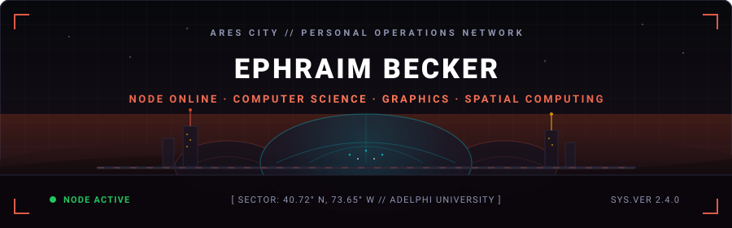
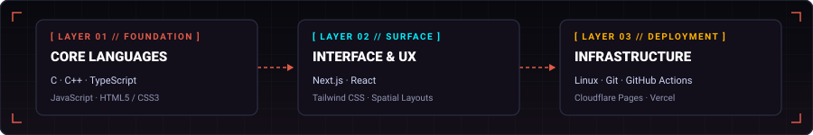
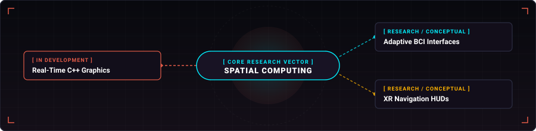

<div align="center">



</div>

<br>

### Operator Profile

> **Ephraim Becker** is an undergraduate Computer Science student (Rising Junior) at **Adelphi University** specializing in real-time graphics programming, full-stack systems, and spatial interfaces.
>
> His work focuses on transitioning foundational web architectures into high-performance C++ graphics systems, exploring how interactive environments can adaptively interface with spatial computing and human cognitive focus states.

---

### Deployed Infrastructure

<div align="center">


</div>

<br>

#### 🛰️ `NODE 01` — [Ares City Command Hub](https://ephraimbecker.com) &nbsp; `[● DEPLOYED // LIVE]`
> **Central Habitat OS personal digital command station and ecosystem.**  
> Engineered with retro-futuristic spatial layouts, modular workspaces, and colony telemetry navigation.
> 
> **Tech Stack:** `Next.js` · `React` · `TypeScript` · `Tailwind CSS` · `Cloudflare Pages`  
> **Direct Uplink:** [ephraimbecker.com ↗](https://ephraimbecker.com)

#### 🚴 `NODE 02` — [Biking Forecast Engine](https://biking.ephraimbecker.com) &nbsp; `[● DEPLOYED // LIVE]`
> **Real-time atmospheric telemetry and wind-vector route optimization engine.**  
> Analyzes live weather feeds to compute route suitability scores and evaluate environmental conditions for cyclists.
> 
> **Tech Stack:** `TypeScript` · `React` · `Tailwind CSS` · `Vercel`  
> **Direct Uplink:** [biking.ephraimbecker.com ↗](https://biking.ephraimbecker.com)

#### 📂 `NODE 03` — [Portfolio Archives](https://ephraimbecker.com/portfolio) &nbsp; `[● DEPLOYED // LIVE]`
> **Comprehensive retrospective engineering index and technical project repository.**  
> Catalogs past and present software architectures, graphics experiments, and interactive web tools.
> 
> **Tech Stack:** `Next.js` · `TypeScript` · `Tailwind CSS` · `Cloudflare Pages`  
> **Direct Uplink:** [ephraimbecker.com/portfolio ↗](https://ephraimbecker.com/portfolio)

---

### Technical Architecture

<div align="center">



</div>

<br>

| Subsystem Layer | Technologies | Functional Scope |
| :--- | :--- | :--- |
| **Core Languages** | `C` · `C++` · `TypeScript` · `JavaScript` · `HTML5` · `CSS3` | Low-level systems programming, real-time rendering algorithms, and type-safe applications. |
| **Interface & Surface** | `Next.js` · `React` · `Tailwind CSS` | Modular frontend architectures, reactive UI states, and responsive design systems. |
| **Runtime & Infrastructure** | `Linux` · `Git` · `GitHub Actions` · `Cloudflare Pages` · `Vercel` | POSIX development environments, automated edge deployment, and CI/CD pipelines. |

---

### Research & Future Directions

<div align="center">



</div>

<br>

* `[RESEARCH / CONCEPTUAL]` **Adaptive Spatial Computing & BCI Focus Architectures** — Investigating theoretical interface frameworks that explore how spatial layouts and information density could dynamically adapt to user attention and cognitive workload.
* `[IN ACTIVE DEVELOPMENT]` **High-Performance C++ Graphics Foundations** — Studying core rasterization math, memory-efficient data structures, and fundamental shader rendering pipelines.
* `[RESEARCH / CONCEPTUAL]` **XR Navigation HUDs** — Conceptualizing heads-up display telemetry layouts for outdoor navigation and cycling environments.

---

### Node Telemetry

```text
+-------------------------------------------------------------------------------+
|  NETWORK TELEMETRY // EPHRAIM BECKER NODE                                     |
+-------------------------------------------------------------------------------+
|  PRIMARY REPOSITORY : EphraimB/EphraimB             HOST: GITHUB CORE         |
|  DEVELOPMENT STATUS : ACTIVE SYNCHRONIZATION        LOCATION: NEW YORK        |
|  SYSTEM DIRECTIVE   : ADVANCING GRAPHICS & SPATIAL SYSTEMS                    |
+-------------------------------------------------------------------------------+
```

---

### Communications

```text
┌── [ARES CITY HUB]      https://ephraimbecker.com
├── [PORTFOLIO ARCHIVE]  https://ephraimbecker.com/portfolio
├── [CODE REPOSITORIES]  https://github.com/EphraimB
└── [LINKEDIN PROFILE]   https://linkedin.com/in/ephraim-becker
```
