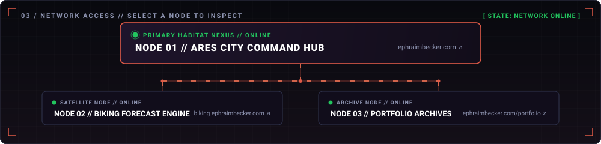
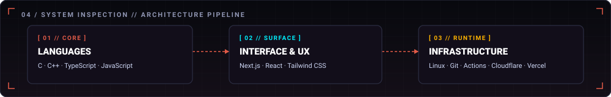
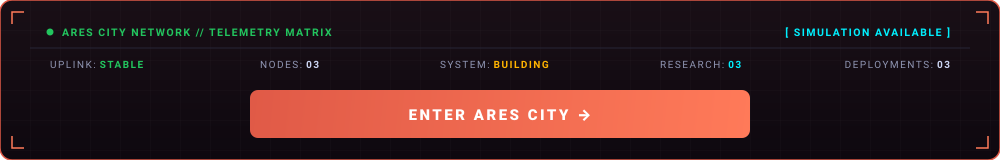

 

  
<b>[ ACCESS DOSSIER ▸ ]</b> &nbsp; <code>OPERATOR ID: EPHRAIM BECKER</code>

   
  <table width="100%">
    <tr>
      <td>
        <b>OPERATOR PROFILE // ACTIVE NODE</b> 
        <b>Ephraim Becker</b> is an undergraduate Computer Science student (Rising Junior) at <b>Adelphi University</b> specializing in real-time graphics pipelines, full-stack systems engineering, and spatial computing interfaces.
          
        <b>CURRENT VECTOR</b> 
        Transitioning web engineering foundations into high-performance C++ graphics pipelines and exploring adaptive spatial interfaces that interface with cognitive focus states.
      </td>
    </tr>
  </table>

 

 

  
<b>[ INSPECT NODE 01 ▸ ]</b> &nbsp; <b>ARES CITY COMMAND HUB</b> &nbsp; <code>● ONLINE</code>

   
  <table width="100%">
    <tr>
      <td>
        <b>NODE SPECIFICATION // 01</b> 
        <b>CLASSIFICATION:</b> Primary Habitat OS Nexus &amp; Personal Operations Center 
        <b>STATUS:</b> <code>● ONLINE // PRODUCTION</code> 
        <b>STACK:</b> <code>Next.js</code> · <code>React</code> · <code>TypeScript</code> · <code>Tailwind CSS</code> · <code>Cloudflare Pages</code>
        
<b>ARCHITECTURE:</b> Central Habitat OS personal digital ecosystem and spatial workspace console. Engineered with retro-futuristic spatial layouts, modular windowed applications, and colony telemetry navigation.

        

          <a href="https://ephraimbecker.com"><b>[ LAUNCH NODE 01 ↗ ]</b></a>
        

      </td>
    </tr>
  </table>

  
<b>[ INSPECT NODE 02 ▸ ]</b> &nbsp; <b>BIKING FORECAST ENGINE</b> &nbsp; <code>● ONLINE</code>

   
  <table width="100%">
    <tr>
      <td>
        <b>NODE SPECIFICATION // 02</b> 
        <b>CLASSIFICATION:</b> Real-Time Atmospheric Vector Satellite 
        <b>STATUS:</b> <code>● ONLINE // PRODUCTION</code> 
        <b>STACK:</b> <code>TypeScript</code> · <code>React</code> · <code>Tailwind CSS</code> · <code>Vercel</code>
        
<b>ARCHITECTURE:</b> Real-time atmospheric telemetry and wind-vector route optimization engine for cyclists. Parses live meteorological data to calculate optimal riding vectors and exposure risks.

        

          <a href="https://biking.ephraimbecker.com"><b>[ LAUNCH NODE 02 ↗ ]</b></a>
        

      </td>
    </tr>
  </table>

  
<b>[ INSPECT NODE 03 ▸ ]</b> &nbsp; <b>PORTFOLIO ARCHIVES</b> &nbsp; <code>● ONLINE</code>

   
  <table width="100%">
    <tr>
      <td>
        <b>NODE SPECIFICATION // 03</b> 
        <b>CLASSIFICATION:</b> Central Engineering Index &amp; Retrospective Vault 
        <b>STATUS:</b> <code>● ONLINE // PRODUCTION</code> 
        <b>STACK:</b> <code>Next.js</code> · <code>TypeScript</code> · <code>Tailwind CSS</code> · <code>Cloudflare Pages</code>
        
<b>ARCHITECTURE:</b> Complete repository of past and present software architectures, graphics experiments, and interactive applications structured for technical review.

        

          <a href="https://ephraimbecker.com/portfolio"><b>[ LAUNCH NODE 03 ↗ ]</b></a>
        

      </td>
    </tr>
  </table>

 

 

  
<b>[ INSPECT CORE ▸ ]</b> &nbsp; <b>LAYER 01 // LANGUAGES &amp; SYSTEMS</b>

   
  <table width="100%">
    <tr>
      <td>
        <b>CORE SYSTEMS // LAYER 01</b> 
        <b>PRIMARY:</b> <code>C</code> · <code>C++</code> 
        <b>APPLICATION:</b> <code>TypeScript</code> · <code>JavaScript</code> 
        <b>SURFACE:</b> <code>HTML5</code> · <code>CSS3</code>
        
<b>TECHNICAL VECTORS:</b> Low-level memory allocation, real-time rasterization algorithms, and type-safe systems.

      </td>
    </tr>
  </table>

  
<b>[ INSPECT SURFACE ▸ ]</b> &nbsp; <b>LAYER 02 // INTERFACE &amp; SPATIAL UX</b>

   
  <table width="100%">
    <tr>
      <td>
        <b>SURFACE &amp; SPATIAL UX // LAYER 02</b> 
        <b>FRAMEWORKS:</b> <code>Next.js</code> · <code>React</code> 
        <b>STYLING:</b> <code>Tailwind CSS</code> · Custom Design Systems 
        <b>METHODOLOGY:</b> Modular Component Hierarchies · Reactive State
        
<b>TECHNICAL VECTORS:</b> Spatial interface primitives, responsive viewports, and keyboard/screen-reader accessibility.

      </td>
    </tr>
  </table>

  
<b>[ INSPECT RUNTIME ▸ ]</b> &nbsp; <b>LAYER 03 // INFRASTRUCTURE &amp; CI/CD</b>

   
  <table width="100%">
    <tr>
      <td>
        <b>RUNTIME &amp; INFRASTRUCTURE // LAYER 03</b> 
        <b>ENVIRONMENT:</b> <code>Linux</code> / POSIX Shell 
        <b>VERSION CONTROL:</b> <code>Git</code> · <code>GitHub Actions (CI/CD)</code> 
        <b>EDGE DEPLOYMENT:</b> <code>Cloudflare Pages</code> · <code>Vercel</code>
        
<b>TECHNICAL VECTORS:</b> Automated continuous integration pipelines, multi-edge CDN routing, and serverless runtime execution.

      </td>
    </tr>
  </table>

 

 

  
<b>[○ RESEARCH]</b> &nbsp; <b>ADAPTIVE BCI SPATIAL INTERFACES</b>

   
  <table width="100%">
    <tr>
      <td>
        <b>RESEARCH VECTOR // 01</b> 
        <b>STATUS:</b> <code>[○ THEORETICAL RESEARCH]</code> 
        <b>DOMAIN:</b> Spatial Computing / Neural Interfaces 
        <b>VECTOR:</b> Attention &amp; Cognitive Workload Adaptation
        
<b>INVESTIGATION:</b> Investigating theoretical interface frameworks that explore how spatial layouts, visual hierarchy, and information density could dynamically adapt to real-time user attention and cognitive workload states.

      </td>
    </tr>
  </table>

  
<b>[◐ BUILDING]</b> &nbsp; <b>REAL-TIME C++ GRAPHICS ENGINES</b>

   
  <table width="100%">
    <tr>
      <td>
        <b>RESEARCH VECTOR // 02</b> 
        <b>STATUS:</b> <code>[◐ ACTIVE ENGINEERING BUILD]</code> 
        <b>DOMAIN:</b> Graphics Systems / Real-Time Rendering 
        <b>VECTOR:</b> Software Rasterization &amp; Shader Pipelines
        
<b>INVESTIGATION:</b> Building custom rasterization mathematics, memory-efficient data structures, and fundamental shader rendering pipelines from first principles to master low-level rendering mechanics.

      </td>
    </tr>
  </table>

  
<b>[◇ CONCEPT]</b> &nbsp; <b>XR NAVIGATION HUDS</b>

   
  <table width="100%">
    <tr>
      <td>
        <b>RESEARCH VECTOR // 03</b> 
        <b>STATUS:</b> <code>[◇ INTERFACE CONCEPT]</code> 
        <b>DOMAIN:</b> Extended Reality (XR) / Telemetry 
        <b>VECTOR:</b> Heads-Up Display Route Telemetry
        
<b>INVESTIGATION:</b> Conceptualizing spatial heads-up display telemetry layouts and peripheral visual cues for dynamic outdoor navigation and high-speed cycling environments.

      </td>
    </tr>
  </table>

  

<code>● SYSTEM ONLINE</code> &nbsp;·&nbsp; <code>STATE: BUILDING</code> &nbsp;·&nbsp; <code>LOCATION: NEW YORK, USA</code>

  

[**PORTFOLIO ARCHIVES ↗**](https://ephraimbecker.com/portfolio) &nbsp;·&nbsp; [**GITHUB REPOSITORIES ↗**](https://github.com/EphraimB) &nbsp;·&nbsp; [**LINKEDIN PROFILE ↗**](https://linkedin.com/in/ephraim-becker)

  

